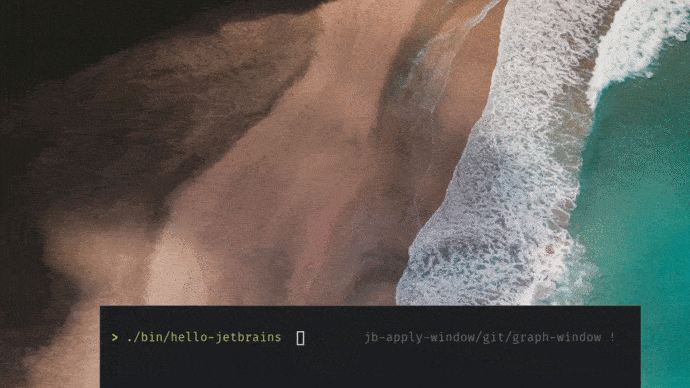

# Hello, JetBrains!

## The task

Create an app, which will create a single-window filled with color #25854b on startup. On mouse clicked a triangle should appear in the window. One of the triangle’s vertices should match with the cursor position. When the mouse is moved with the button pressed, the triangle should move with the cursor. The application should finish correctly on the closing window via window manager and should not break with a segfault on changing window dimensions.



## Prerequisites

- Linux distribution 
  (Tested on Arch Linux 5.10.25-1-lts. Probably, every Linux distro would be good)
- X-Server running
- C++ compiler (gcc, clang, ...)
- CMake

```bash
# On Arch
sudo pacman -S gcc cmake glew libx11

# Other platforms: TBD
```

## Building

```bash
mkdir build
cd build
cmake ..
cmake --build .
```

## Running

```bash
cd <repo-root>
./bin/hello-jetbrains
```

## Design

Read the [DESIGN.md](./DESIGN.md) document
